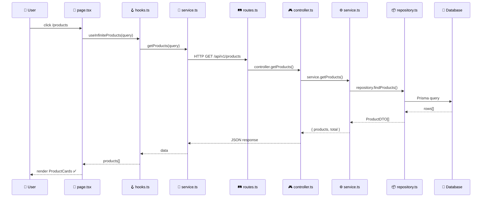

# /explain - Giải Thích Code Trực Quan

$ARGUMENTS

---

## 🎯 Mục Đích

Workflow này giúp hiểu code thông qua **MỘT biểu đồ tổng hợp** bao gồm:
- **Layer Architecture** - Phân tầng hệ thống
- **Execution Flow** - Code chạy ra sao
- **Data Flow** - Dữ liệu đi đâu
- **File References** - File nào thực hiện

---

## 📋 Quy Trình

### Phase 1: Xác Định Phạm Vi
Hỏi user nếu chưa rõ: file/function/feature nào? Mức độ chi tiết?

### Phase 2: Biểu Đồ Flow
Trình bày biểu đồ theo template để user có cái nhìn tổng quan về toàn bộ luồng.

### Phase 3: Giải Thích Code Tuần Tự
Từ biểu đồ, đi sâu vào từng bước theo thứ tự execution flow. Mỗi bước giải thích:
- File và function cụ thể
- Code snippet quan trọng
- Giải thích logic chi tiết
- Input/Output của bước đó

---

## 📝 TEMPLATE OUTPUT

```markdown
## 🗺️ Giải Thích: [Tên Feature]

### 📌 Tổng Quan
> **Làm gì:** [1-2 câu]
> **Entry point:** [Route/Component]

---

### 🎭 UI Flow

| Bước | User Thấy | User Làm | Kết Quả |
|------|-----------|----------|---------|
| 1 | ... | ... | ... |
| 2 | ... | ... | ... |

---

### 🔄 Complete Flow Diagram

Chọn **MỘT** trong các dạng sau:
```

---

## 📊 DẠNG 1: COMPLETE FLOW (Chi tiết - ƯU TIÊN)

Biểu đồ tổng hợp với đầy đủ: Layer + Execution + Data + Files

```
╔══════════════════════════════════════════════════════════════════════════════╗
║                         🔄 COMPLETE FLOW: [Feature Name]                     ║
╠══════════════════════════════════════════════════════════════════════════════╣
║                                                                              ║
║  👤 USER ACTION: [mô tả action, vd: click "/products?featured=true"]        ║
║                                                                              ║
╠══════════════════════════════════════════════════════════════════════════════╣
║  📱 FRONTEND LAYER                                                           ║
╠══════════════════════════════════════════════════════════════════════════════╣
║                                                                              ║
║  ┌────────────────────────────────────────────────────────────────────────┐  ║
║  │ 1️⃣ PAGE/COMPONENT                                                      │  ║
║  │    📁 app/(layouts)/products/products-client.tsx                       │  ║
║  │    ──────────────────────────────────────────────────────────────────  │  ║
║  │    📥 Input:  URL params (?featured=true)                              │  ║
║  │    ⚙️  Action: Parse URL → Build filterMode                            │  ║
║  │    📤 Output: { featured: true, page: 1 }                              │  ║
║  └───────────────────────────────┬────────────────────────────────────────┘  ║
║                                  │                                           ║
║                                  ▼                                           ║
║  ┌────────────────────────────────────────────────────────────────────────┐  ║
║  │ 2️⃣ HOOK (React Query)                                                  │  ║
║  │    📁 hooks/use-products.ts → useInfiniteProducts()                    │  ║
║  │    ──────────────────────────────────────────────────────────────────  │  ║
║  │    📥 Input:  { featured: true, page: 1 }                              │  ║
║  │    ⚙️  Action: Build query, manage cache, pagination                   │  ║
║  │    📤 Output: Call productService.getProducts()                        │  ║
║  └───────────────────────────────┬────────────────────────────────────────┘  ║
║                                  │                                           ║
║                                  ▼                                           ║
║  ┌────────────────────────────────────────────────────────────────────────┐  ║
║  │ 3️⃣ SERVICE (HTTP Client)                                               │  ║
║  │    📁 services/product.service.ts → getProducts()                      │  ║
║  │    ──────────────────────────────────────────────────────────────────  │  ║
║  │    📥 Input:  ProductsQuery object                                     │  ║
║  │    ⚙️  Action: Build HTTP request, add auth headers                    │  ║
║  │    📤 Output: GET /api/v1/products?featured=true                       │  ║
║  └───────────────────────────────┬────────────────────────────────────────┘  ║
║                                  │                                           ║
║ ═══════════════════════════════════════════════════════════════════════════  ║
║                          🌐 HTTP REQUEST                                     ║
║ ═══════════════════════════════════════════════════════════════════════════  ║
║                                  │                                           ║
╠══════════════════════════════════════════════════════════════════════════════╣
║  ⚙️  BACKEND LAYER                                                           ║
╠══════════════════════════════════════════════════════════════════════════════╣
║                                  │                                           ║
║                                  ▼                                           ║
║  ┌────────────────────────────────────────────────────────────────────────┐  ║
║  │ 4️⃣ ROUTES                                                              │  ║
║  │    📁 modules/product/routes/product.routes.ts                         │  ║
║  │    ──────────────────────────────────────────────────────────────────  │  ║
║  │    ⚙️  Action: Match route GET /products → controller.getProducts()    │  ║
║  └───────────────────────────────┬────────────────────────────────────────┘  ║
║                                  │                                           ║
║                                  ▼                                           ║
║  ┌────────────────────────────────────────────────────────────────────────┐  ║
║  │ 5️⃣ CONTROLLER                                                          │  ║
║  │    📁 modules/product/controllers/product.controller.ts                │  ║
║  │    ──────────────────────────────────────────────────────────────────  │  ║
║  │    📥 Input:  ctx.query (query string params)                          │  ║
║  │    ⚙️  Action: Validate params, parse types                            │  ║
║  │    📤 Output: QueryOptions → service.getProducts()                     │  ║
║  └───────────────────────────────┬────────────────────────────────────────┘  ║
║                                  │                                           ║
║                                  ▼                                           ║
║  ┌────────────────────────────────────────────────────────────────────────┐  ║
║  │ 6️⃣ SERVICE (Business Logic)                                            │  ║
║  │    📁 modules/product/services/product.service.ts                      │  ║
║  │    ──────────────────────────────────────────────────────────────────  │  ║
║  │    📥 Input:  QueryOptions { featured, page, limit }                   │  ║
║  │    ⚙️  Action: Apply business rules, call repository                   │  ║
║  │    📤 Output: repository.findProducts() → mapToProductDTO()            │  ║
║  └───────────────────────────────┬────────────────────────────────────────┘  ║
║                                  │                                           ║
║                                  ▼                                           ║
║  ┌────────────────────────────────────────────────────────────────────────┐  ║
║  │ 7️⃣ REPOSITORY (Data Access)                                            │  ║
║  │    📁 modules/product/repositories/product.repository.ts               │  ║
║  │    ──────────────────────────────────────────────────────────────────  │  ║
║  │    📥 Input:  QueryOptions                                             │  ║
║  │    ⚙️  Action: Build Prisma query, filters, joins                      │  ║
║  │    📤 Output: prisma.wiz_products.findMany() → raw data                │  ║
║  └───────────────────────────────┬────────────────────────────────────────┘  ║
║                                  │                                           ║
╠══════════════════════════════════════════════════════════════════════════════╣
║  💾 DATABASE LAYER                                                           ║
╠══════════════════════════════════════════════════════════════════════════════╣
║                                  │                                           ║
║                                  ▼                                           ║
║  ┌────────────────────────────────────────────────────────────────────────┐  ║
║  │ 8️⃣ DATABASE QUERY                                                      │  ║
║  │    📁 PostgreSQL via Prisma                                            │  ║
║  │    ──────────────────────────────────────────────────────────────────  │  ║
║  │    🗃️  Tables: wiz_products, wiz_inventory_variants, wiz_categories    │  ║
║  │    📤 Output: rows[] (raw database records)                            │  ║
║  └───────────────────────────────┬────────────────────────────────────────┘  ║
║                                  │                                           ║
║ ═══════════════════════════════════════════════════════════════════════════  ║
║                          🔙 RESPONSE FLOW                                    ║
║ ═══════════════════════════════════════════════════════════════════════════  ║
║                                  │                                           ║
║                                  ▼                                           ║
║  ┌────────────────────────────────────────────────────────────────────────┐  ║
║  │ 9️⃣ DTO MAPPING (Backend)                                               │  ║
║  │    📁 modules/product/services/product.service.ts → mapToProductDTO()  │  ║
║  │    ──────────────────────────────────────────────────────────────────  │  ║
║  │    📥 Input:  Raw DB rows                                              │  ║
║  │    ⚙️  Action: Transform, localize, format                             │  ║
║  │    📤 Output: ProductDTO[] + pagination info                           │  ║
║  └───────────────────────────────┬────────────────────────────────────────┘  ║
║                                  │                                           ║
║                                  ▼                                           ║
║                         JSON Response to Frontend                            ║
║                                  │                                           ║
╠══════════════════════════════════════════════════════════════════════════════╣
║  🎨 RENDER LAYER                                                             ║
╠══════════════════════════════════════════════════════════════════════════════╣
║                                  │                                           ║
║                                  ▼                                           ║
║  ┌────────────────────────────────────────────────────────────────────────┐  ║
║  │ 🔟 UI COMPONENT                                                         │  ║
║  │    📁 components/common/product-card.tsx                               │  ║
║  │    📁 app/store-client/components/product-list-api.tsx                 │  ║
║  │    ──────────────────────────────────────────────────────────────────  │  ║
║  │    📥 Input:  ProductDTO[]                                             │  ║
║  │    ⚙️  Action: Map to ProductCard components                           │  ║
║  │    📤 Output: Rendered product grid ✅                                  │  ║
║  └────────────────────────────────────────────────────────────────────────┘  ║
║                                                                              ║
╚══════════════════════════════════════════════════════════════════════════════╝
```

---

## 📊 DẠNG 2: COMPACT FLOW (Ngắn gọn)

Dùng khi cần giải thích nhanh, ít chi tiết hơn:

```
╔════════════════════════════════════════════════════════════════════════════╗
║                    🔄 COMPACT FLOW: [Feature Name]                         ║
╠════════════════════════════════════════════════════════════════════════════╣
║                                                                            ║
║  👤 User: [action description]                                             ║
║                                                                            ║
║  ┌─────────────────────────────────────────────────────────────────────┐   ║
║  │ 📱 FRONTEND                                                          │   ║
║  ├─────────────────────────────────────────────────────────────────────┤   ║
║  │                                                                      │   ║
║  │  📁 page.tsx          │  📁 hooks.ts         │  📁 service.ts       │   ║
║  │  ──────────────────   │  ──────────────────  │  ──────────────────  │   ║
║  │  Parse URL params     │  React Query cache   │  HTTP GET request    │   ║
║  │  { featured: true }   │  useInfiniteProducts │  /api/v1/products    │   ║
║  │         │             │         │            │         │            │   ║
║  │         └─────────────┴─────────┴────────────┴─────────┘            │   ║
║  │                                 │                                    │   ║
║  └─────────────────────────────────┼────────────────────────────────────┘   ║
║                                    │ HTTP                                   ║
║  ┌─────────────────────────────────▼────────────────────────────────────┐   ║
║  │ ⚙️  BACKEND                                                          │   ║
║  ├─────────────────────────────────────────────────────────────────────┤   ║
║  │                                                                      │   ║
║  │  📁 routes.ts         │  📁 controller.ts   │  📁 service.ts        │   ║
║  │  ──────────────────   │  ──────────────────  │  ──────────────────  │   ║
║  │  Route matching       │  Validate params     │  Business logic      │   ║
║  │  GET /products        │  Parse query         │  Apply filters       │   ║
║  │         │             │         │            │         │            │   ║
║  │         └─────────────┴─────────┴────────────┴─────────┘            │   ║
║  │                                 │                                    │   ║
║  │  📁 repository.ts                                                    │   ║
║  │  ──────────────────────────────────────────────────────────────────  │   ║
║  │  Prisma query: wiz_products + variants + categories                  │   ║
║  │                                 │                                    │   ║
║  └─────────────────────────────────┼────────────────────────────────────┘   ║
║                                    │                                        ║
║  ┌─────────────────────────────────▼────────────────────────────────────┐   ║
║  │ 💾 DATABASE                                                          │   ║
║  ├─────────────────────────────────────────────────────────────────────┤   ║
║  │  Tables: wiz_products, wiz_inventory_variants, wiz_categories        │   ║
║  └─────────────────────────────────┬────────────────────────────────────┘   ║
║                                    │                                        ║
║                              🔙 Response                                    ║
║                                    │                                        ║
║  ┌─────────────────────────────────▼────────────────────────────────────┐   ║
║  │ 🎨 RENDER                                                            │   ║
║  ├─────────────────────────────────────────────────────────────────────┤   ║
║  │  📁 product-card.tsx  → ProductDTO[] → Grid UI ✅                    │   ║
║  └─────────────────────────────────────────────────────────────────────┘   ║
║                                                                            ║
╚════════════════════════════════════════════════════════════════════════════╝
```

---

## 📊 DẠNG 3: MERMAID SEQUENCE (Cho doc/presentation)



---

## 🔴 CRITICAL RULES

1. **LUÔN ghi tên file** - Mỗi bước phải có `📁 filename.ts`
2. **3 phần trong 1 biểu đồ** - Layer + Execution + Data đều có trong diagram
3. **Input/Output rõ ràng** - Mỗi bước có 📥 Input, ⚙️ Action, 📤 Output
4. **Phân layer bằng khung** - Dùng ╔═══╗ để phân tách layers
5. **TIẾNG VIỆT** - Giải thích tiếng Việt, code giữ Anh
6. **Ưu tiên DẠNG 1 hoặc 2** - Mermaid chỉ dùng khi cần export/share

---

## ⚡ Quick Mode

Nếu user cần nhanh:

```markdown
## ⚡ [Tên Feature]

**Flow:** User → page.tsx → hooks.ts → service.ts → ═══ HTTP ═══ → routes.ts → controller.ts → service.ts → repository.ts → DB → Response → Render ✅

**Key files:**
- Frontend: `page.tsx`, `hooks.ts`, `service.ts`
- Backend: `controller.ts`, `service.ts`, `repository.ts`
```

---

## 📖 PHASE 3: GIẢI THÍCH CODE TUẦN TỰ

Sau khi trình bày biểu đồ, đi qua từng bước theo thứ tự execution flow. Giải thích như đang pair programming với user - tường thuật chi tiết, không dùng bảng.

---

### FORMAT CHO MỖI STEP:

#### 🔢 Step [số]: [Tên Step]

**📁 File:** [đường/dẫn/file.ts](file:///đường/dẫn/đầy/đủ/file.ts) - function `tên_function()`

Bắt đầu bằng 1-2 câu mô tả step này làm gì trong tổng thể flow.

Sau đó show code snippet quan trọng:

```typescript
// Code snippet 10-20 lines
// Chỉ lấy phần liên quan đến step này
```

Tiếp theo giải thích từng phần code theo dạng tường thuật:

Đầu tiên, code lấy `selectedProject` từ Zustand store - đây là thông tin employee đang login thuộc project nào. Biến `isAuthenticated` check xem có đang login hay không.

Sau đó, logic ưu tiên được áp dụng: nếu URL có `projectId` (qua `extraQuery`) thì dùng giá trị đó, nếu không thì fallback về project từ store. Điều này cho phép deep linking với projectId cụ thể.

Cuối cùng, query object được build với tất cả params: `categoryId`, `search`, `orderBy`... Operator `??` (nullish coalescing) đảm bảo fallback về giá trị mặc định khi undefined.

**Điểm quan trọng cần nhớ:**
- [Highlight logic đặc biệt hoặc edge case]
- [Lý do tại sao code viết như vậy]

**Chuyển tiếp:** Query object này được pass vào `useInfiniteProducts()` hook → chuyển sang Step 2.

---

### VÍ DỤ HOÀN CHỈNH:

```markdown
## 📖 GIẢI THÍCH CODE CHI TIẾT

---

#### 🔢 Step 1: Component Build Query

**📁 File:** [product-list-api.tsx](file:///tpshop/app/store-client/components/product-list-api.tsx) - function `ProductListAPI()`

Component này là entry point của UI hiển thị products. Nhiệm vụ chính là parse các params từ props và URL, merge lại thành query object để gọi API.

```typescript
// Line 82-98
const { selectedProject, isAuthenticated } = useEmployeeStore();
const projectIdFromStore = isAuthenticated && selectedProject 
  ? selectedProject.id 
  : undefined;
const projectId = extraQuery?.projectId ?? projectIdFromStore;

const query = {
  categoryId,
  search: debouncedSearch || extraQuery?.search || undefined,
  orderBy: extraQuery?.orderBy ?? sortBy,
  limit: extraQuery?.limit ?? 12,
  projectId,
  ...extraQuery,
};
```

Đầu tiên, code lấy thông tin project từ Zustand store thông qua `useEmployeeStore()`. Store này lưu trạng thái đăng nhập của employee và project họ được assign.

Tiếp theo là logic xác định `projectId`. Code sử dụng pattern priority chain: ưu tiên giá trị từ URL (`extraQuery?.projectId`) trước, nếu undefined thì mới fallback về store (`projectIdFromStore`). Điều này quan trọng vì cho phép user share link với projectId cụ thể.

Query object được build với spread operator `...extraQuery` ở cuối, cho phép parent component override bất kỳ giá trị nào. Search dùng `||` thay vì `??` vì muốn treat empty string `""` như undefined.

**Điểm quan trọng:**
- `debouncedSearch` đã được debounce 300ms ở trên, tránh spam API call khi user đang gõ
- `limit: 12` là default, parent có thể override qua `extraQuery`

**Chuyển tiếp:** Object `query` này được pass vào `useInfiniteProducts(query)` → Step 2

---

#### 🔢 Step 2: React Query Hook

**📁 File:** [use-products.ts](file:///tpshop/hooks/use-products.ts) - function `useInfiniteProducts()`

Hook này wrap React Query's `useInfiniteQuery` để handle caching và infinite scroll pagination.

```typescript
export function useInfiniteProducts(query?: Omit<ProductsQuery, 'page'>) {
  return useInfiniteQuery({
    queryKey: productKeys.list(query || {}),
    queryFn: async ({ pageParam = 1 }) => {
      const response = await productService.getProducts({
        ...query,
        page: pageParam,
      });
      if (!response.success) throw new Error(response.message);
      return response.data!;
    },
    getNextPageParam: (lastPage) => 
      lastPage.page < lastPage.totalPages ? lastPage.page + 1 : undefined,
    staleTime: 2 * 60 * 1000,
  });
}
```

`queryKey` sử dụng factory pattern từ `productKeys.list()`. Mỗi combination của query params tạo ra một cache key riêng. Ví dụ: `['products', 'list', { categoryId: 'abc', limit: 12 }]`. React Query sẽ tự động re-fetch khi bất kỳ param nào thay đổi.

Trong `queryFn`, page number đến từ `pageParam` - React Query quản lý giá trị này tự động. Page đầu tiên là 1 (từ `initialPageParam`). Khi user scroll xuống, `fetchNextPage()` được gọi và React Query tự tăng pageParam.

`getNextPageParam` quyết định có còn page tiếp theo không. Logic đơn giản: nếu `page < totalPages` thì return `page + 1`, ngược lại return `undefined` để báo hết data.

`staleTime: 2 * 60 * 1000` (2 phút) có nghĩa data được coi là fresh trong 2 phút. Trong thời gian này, nếu component unmount rồi mount lại, React Query sẽ dùng cached data thay vì gọi API mới.

**Chuyển tiếp:** Hook gọi `productService.getProducts()` → Step 3

---

(Tiếp tục cho các steps còn lại với style tương tự...)
```

---

## 🔴 RULES CHO PHASE 3

1. **Giải thích dạng tường thuật** - Viết như đang giảng bài, không dùng bullet points/bảng cho phần giải thích chính
2. **Giữ thứ tự execution flow** - Theo đúng số thứ tự trong biểu đồ  
3. **Chuyển tiếp rõ ràng** - Cuối mỗi step phải nói chuyển sang step nào
4. **Code snippet trước, giải thích sau** - Show code rồi mới explain
5. **Giải thích WHY không chỉ WHAT** - Tại sao code viết như này, không chỉ describe
6. **Highlight điểm quan trọng** - Dùng **Điểm quan trọng:** cho những thứ dễ miss

---

## 📋 CHECKLIST HOÀN THÀNH

- [ ] Phase 1: Xác định scope
- [ ] Phase 2: Biểu đồ flow (COMPLETE/COMPACT)
- [ ] Phase 3: Giải thích từng step tuần tự (dạng tường thuật)
- [ ] Key Logic Points (điểm quan trọng cần nhớ)

